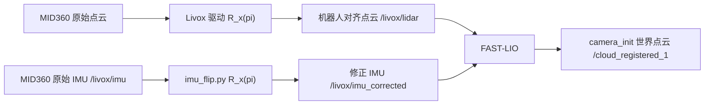

# G1 MID360 + FAST-LIO 建图转弯点云漂移问题解决报告

## 1. 报告信息

| 项目 | 内容 |
|---|---|
| 项目目录 | `/data/unitree/botbrain_ws/botbrain_ws` |
| 机器人平台 | Unitree G1 |
| 激光雷达 | Livox MID360，倒装安装 |
| 建图算法 | FAST-LIO / FAST-LIO2 ROS 2 版本 |
| 可视化工具 | Foxglove、RViz2 |
| FAST-LIO 世界坐标系 | `camera_init` |
| 报告日期 | 2026-07-10 |
| 修正状态 | 代码、配置和运行文档修正完成；G1 实机编译与动态验收待执行 |
| Git 操作 | 未执行 `git add`、`git commit` 或 `git push` |

---

## 2. 问题概述

### 2.1 现场表现

在使用 FAST-LIO 建图时，机器人直行阶段可能暂时正常，但一旦发生转弯，尤其是原地左转或右转，会出现以下现象：

1. 机器人转弯时，走廊、墙体、门框等本应固定在世界坐标系中的点云也跟随机器人一起旋转。
2. 转弯同时伴随整片点云横向移动、墙体重影或地图倾斜。
3. 有时转弯后还能短暂稳定一段时间，随后点云突然严重漂移，导致无法继续建图。
4. 导航定位阶段使用已有 PCD 地图时相对稳定，但实时建图阶段无法像导航一样持续“拉回”到固定地图。

典型现象可以描述为：

```text
机器人原本面向前方，正前方是一条明显走廊；
机器人向左转时，走廊也跟着向左转；
机器人和环境点云看起来相对静止，整个场景一起运动。
```

### 2.2 Foxglove 显示设置确认

现场使用的 Foxglove 设置为：

```text
Fixed Frame          = camera_init
Display/Follow Frame = camera_init
PointCloud topic     = /cloud_registered_1
```

这是正确的世界坐标显示设置。

`/cloud_registered_1` 在 FAST-LIO 源码中已经被转换到 `camera_init`，其消息 `frame_id` 也是 `camera_init`。因此，当 Fixed Frame 和 Display/Follow Frame 都是 `camera_init` 时，环境点云仍然随机器人旋转，说明问题不是 Foxglove 视角跟随，而是 FAST-LIO 估计并发布的世界位姿发生了错误。

需要注意：

- `/cloud_registered_1`：世界坐标点云，用于判断地图是否稳定。
- `/cloud_registered_body_1`：机器人 body 坐标点云，相对机器人基本静止并随机器人转动是正常定义，不能用它判断世界地图是否漂移。

---

## 3. 问题定位过程

### 3.1 从显示问题排除到位姿估计问题

FAST-LIO 发布世界点云的关键代码位于：

```text
botbrain_ws/src/fast_lio/src/laserMapping.cpp
```

`publish_frame_world()` 会调用 `RGBpointBodyToWorld()`，使用 FAST-LIO 当前 ESKF 状态，将当前点云从 body 坐标转换到世界坐标，然后直接设置：

```cpp
laserCloudmsg.header.frame_id = "camera_init";
```

因此 `/cloud_registered_1` 中的点坐标本身已经包含 FAST-LIO 估计的旋转和平移，并不是 Foxglove 再临时通过 TF 转换出来的。

结论：

```text
camera_init 中的整片点云随机器人转动
= FAST-LIO 的状态旋转/平移估计错误
≠ Foxglove Follow Frame 设置错误
```

### 3.2 Git 历史定位

通过检查相关文件的 Git 历史，核心回归被定位到：

```text
提交：84ded38ea3bc9263f40d69352129e7c212c4785a
时间：2026-07-09 14:02:47 +0800
说明：增加rviz可视化,以及修图
```

该提交同时做了两个与 FAST-LIO 坐标关系直接相关的修改：

### 修改一：删除 IMU 倒装修正

提交前：

```yaml
imu_topic: "/livox/imu_corrected"
```

并由 `imu_flip.py` 对原始 IMU 的 Y/Z 轴取反。

提交后：

```yaml
imu_topic: "/livox/imu"
```

同时从 `fast_lio.launch.py` 中删除了 `imu_flip.py` 节点。

### 修改二：错误修改 LiDAR–IMU 平移外参

提交前：

```yaml
extrinsic_T: [-0.011, -0.02329, 0.04412]
```

提交后：

```yaml
extrinsic_T: [-0.011, -0.02329, 1.247]
```

这里错误地把机器人站立时 MID360/IMU 的离地高度 `1.247 m` 当成了 MID360 内部 LiDAR 相对内置 IMU 的刚性平移外参。

### 3.3 2026-07-10 当天尝试的作用分析

2026-07-10 当天的相关修改包括：

- 将 `MAX_INI_COUNT` 从 10 增加到 200；
- 将 MID360 发布频率从 20 Hz 调整为 10 Hz；
- 增加等待 `IMU Initial Done` 的说明；
- 清理 `mid360.yaml` 注释；
- 调整建图启动和容器清理命令。

这些修改有助于延长静止初始化时间、匹配 FAST-LIO 的扫描频率和避免旧容器残留，但不会修复以下两个根本问题：

```text
点云坐标轴与 IMU 坐标轴不一致
LiDAR–IMU 平移外参被错误扩大到 1.247 m
```

因此，即使初始化日志正常、发布频率调整正确，机器人转弯时仍可能出现整片点云跟随旋转和横移。

---

## 4. 根因一：倒装点云和原始 IMU 坐标轴不一致

### 4.1 MID360 的安装姿态

项目中的 MID360 倒装配置有两处直接证据。

### Livox 驱动配置

文件：

```text
botbrain_ws/src/g1_pkg/config/MID360_config.json
```

配置：

```json
"extrinsic_parameter": {
  "roll": 180.0,
  "pitch": 0.0,
  "yaw": 0.0,
  "x": 0,
  "y": 0,
  "z": 0
}
```

### 机器人 URDF/Xacro

文件：

```text
botbrain_ws/src/g1_pkg/xacro/robot.xacro
```

配置：

```xml
<joint name="$(arg prefix)mid360_joint" type="fixed">
  <origin xyz="0 0 0" rpy="3.14159 0 0"/>
  <parent link="$(arg prefix)mid360_base_link"/>
  <child link="$(arg prefix)mid360_link"/>
</joint>
```

两处均表明 MID360 绕 X 轴倒装约 180°。

### 4.2 Livox 驱动对点云和 IMU 的处理不一致

Livox ROS Driver 2 的点云发布路径会根据配置的外参，对点坐标应用旋转和平移。

但是其 `InitImuMsg()` 处理逻辑直接将原始 IMU 数据复制到 ROS 消息：

```text
gyro_x/y/z -> angular_velocity.x/y/z
acc_x/y/z  -> linear_acceleration.x/y/z
```

没有同步应用 `MID360_config.json` 中的安装旋转。

因此实际数据链路变成：

```text
MID360 原生点云
    ↓ Livox 驱动应用 roll=180°
机器人对齐后的点云

MID360 原生 IMU
    ↓ 驱动直接复制，不应用 roll=180°
仍然是倒装传感器轴向的 IMU
```

### 4.3 正确的 IMU 旋转

绕 X 轴 180°的旋转矩阵为：

```text
          [ 1   0   0 ]
R_x(π) =  [ 0  -1   0 ]
          [ 0   0  -1 ]
```

因此修正规则是：

```text
x 保持不变
y 取反
z 取反
```

需要同时修正：

```text
angular_velocity.y
angular_velocity.z
linear_acceleration.y
linear_acceleration.z
```

修正后的数据流为：



### 4.4 为什么转弯时表现最明显

FAST-LIO 在每次点云匹配前，会先使用 IMU 做状态传播和点云运动畸变补偿。

当机器人进行左转或右转时，yaw 主要由 `angular_velocity.z` 表示。倒装 180°后，如果没有修正，Z 轴角速度方向会相反。

可能发生的错误链路为：

```text
机器人实际左转
→ 原始倒装 IMU 的 gyro.z 方向与机器人 Z-up 坐标相反
→ FAST-LIO 预测错误的 yaw 方向
→ 当前扫描的运动补偿错误
→ scan-to-map 初始姿态错误
→ ICP/迭代滤波匹配落入错误位置或无法收敛
→ 当前点云按错误姿态转换到 camera_init
→ 走廊、墙面跟着机器人一起旋转
```

直行时 yaw 变化较小，因此问题可能暂时被走廊侧墙约束掩盖；一旦转弯，角速度符号和点云去畸变错误会集中暴露。

---

## 5. 根因二：把传感器离地高度误当成 LiDAR–IMU 外参

### 5.1 FAST-LIO 外参的真实定义

FAST-LIO 文档中对外参的定义是：

```text
extrinsic_T / extrinsic_R
= LiDAR 在 IMU body frame 中的位置和旋转
```

也就是说，这里的 IMU 是与 LiDAR 配套使用的 MID360 内置 IMU。

它不是：

- MID360 到机器人脚底的高度；
- MID360 到地面的高度；
- `base_link` 到地面的高度；
- 为了让地图地面显示在 z=0 而设置的偏移。

### 5.2 错误外参造成的虚假杠杆臂

错误配置：

```yaml
extrinsic_T: [-0.011, -0.02329, 1.247]
```

恢复配置：

```yaml
extrinsic_T: [-0.011, -0.02329, 0.04412]
```

Z 方向错误量为：

```text
1.247 - 0.04412 = 1.20288 m
```

这相当于告诉 FAST-LIO：LiDAR 和内置 IMU 之间存在约 1.2 米的刚性杠杆臂。

但实际上 MID360 内部 LiDAR 与 IMU 的距离只有厘米级。

### 5.3 为什么 G1 转弯时会出现明显假平移

G1 是双足机器人，行走和原地转弯时通常伴随 roll/pitch 摆动。错误的 1.2 米杠杆臂会把姿态变化放大成平移。

近似误差为：

```text
假平移 ≈ 杠杆臂长度 × 姿态变化角度（弧度）
```

以 `1.20288 m` 为例：

| G1 姿态摆动 | 约产生的假平移 |
|---|---:|
| 5° | 约 0.105 m |
| 10° | 约 0.209 m |

因此会出现：

- 墙面在转弯时横向滑动；
- 同一面墙产生多层重影；
- 点云先旋转再平移；
- 转弯几次后局部地图被错误点污染；
- 后续匹配突然崩溃并产生严重漂移。

### 5.4 `1.247 m` 应该在哪里使用

`1.247 m` 是机器人站立时 MID360/IMU 近似离地高度，可用于：

1. `camera_init` 世界点云中的地面高度预期；
2. 实时 2D OccupancyGrid 在 3D 视图中的显示高度；
3. 建图后把 PCD 地面平移到 `z=0` 的离线处理；
4. 导航定位初始位姿的 Z 高度。

在机器人平地站立、`camera_init` 原点接近初始 IMU 位置时，地面通常应位于：

```text
z ≈ -1.247 m
```

不能为了让地面显示为 `z=0`，将 `1.247` 写入 FAST-LIO 的 `extrinsic_T.z`。

---

## 6. 为什么开始稳定、转弯后过一段时间才突然严重漂移

该现象并不与上述根因矛盾，典型过程如下：

1. 机器人静止初始化时，IMU 加速度模长仍可能接近重力，因此初始化流程可以结束。
2. 直行时 yaw 变化小，走廊侧墙可以暂时对横向位置提供约束。
3. 第一次转弯时，错误 gyro.z、错误点云去畸变和错误杠杆臂开始产生姿态与平移误差。
4. FAST-LIO 的 scan-to-map 可能在短时间内仍找到局部对应关系，所以表面上又稳定了一段时间。
5. 错误位姿下的点逐渐被加入增量地图，同一墙面开始出现重影。
6. 长走廊主要由平行墙面和地面组成，几何约束退化，错误匹配更难被纠正。
7. 当误差超过局部匹配的收敛范围后，状态跳到错误局部最优，出现突然严重漂移。

FAST-LIO 建图过程没有全局回环和位姿图优化，所以已经插入地图的错误历史点不会因为“再走一遍”或“回到起点”自动被整体校正。

---

## 7. 为什么导航定位比建图稳定

项目中的导航定位使用：

```text
预先保存的全局 PCD 地图
+
Open3D ICP 配准
```

相关入口：

```text
botbrain_ws/src/g1_pkg/launch/localization_3d.launch.py
botbrain_ws/src/open3d_loc/src/global_localization.cpp
```

导航阶段的 ICP 始终有一张不会移动的全局地图作为 target，可以周期性将当前扫描重新约束到全局 PCD。

而 FAST-LIO 建图阶段使用的是：

```text
IMU 状态传播
+
当前扫描到局部增量地图匹配
```

两者差异如下：

| 对比项 | FAST-LIO 建图 | 导航 Open3D 定位 |
|---|---|---|
| 参考地图 | 正在生成的局部增量地图 | 已保存且固定的全局 PCD |
| IMU 作用 | 状态传播和点云去畸变的核心输入 | FAST-LIO 局部里程计仍可使用，但全局 ICP 会重新约束 |
| 错误点是否污染参考 | 会，错误点可能被插入增量地图 | 固定 PCD 不会被当前错误扫描改写 |
| 全局重定位 | 无 | 有全局地图 ICP 约束 |
| 回环优化 | 当前实现无 | 不依靠建图回环，而是直接匹配固定地图 |

因此导航看起来能够在转弯时通过 ICP 把机器人重新定位，而建图一旦 IMU、外参或时间同步错误，就更容易持续漂移。

---

## 8. 已实施的代码和配置修正

### 8.1 `mid360.yaml`

文件：

```text
botbrain_ws/src/fast_lio/config/mid360.yaml
```

### 修正一：FAST-LIO 订阅 corrected IMU

修正前：

```yaml
imu_topic: "/livox/imu"
```

修正后：

```yaml
imu_topic: "/livox/imu_corrected"
```

### 修正二：恢复厘米级 LiDAR–IMU 外参

修正前：

```yaml
extrinsic_T: [-0.011, -0.02329, 1.247]
```

修正后：

```yaml
extrinsic_T: [-0.011, -0.02329, 0.04412]
extrinsic_R: [1., 0., 0., 0., 1., 0., 0., 0., 1.]
```

说明：

- `0.04412` 是恢复项目此前使用的厘米级配置；
- 此次修复的目标是先消除 `1.247 m` 明显错误的虚假杠杆臂；
- 如果实机测试后只剩下较小的厘米级误差，可进一步做精细 LiDAR–IMU 外参标定。

### 8.2 `imu_flip.py`

文件：

```text
botbrain_ws/src/g1_pkg/scripts/imu_flip.py
```

修正内容：

1. 订阅 `/livox/imu`；
2. 发布 `/livox/imu_corrected`；
3. 对角速度 Y/Z 取反；
4. 对线加速度 Y/Z 取反；
5. 保留原始时间戳和 frame id；
6. 使用 RELIABLE、KEEP_LAST、depth=50 的 QoS；
7. 统计前 200 个 corrected IMU 样本；
8. 输出平均加速度和模长诊断日志；
9. 增加节点正常退出清理。

核心修正：

```python
msg.angular_velocity.y *= -1.0
msg.angular_velocity.z *= -1.0
msg.linear_acceleration.y *= -1.0
msg.linear_acceleration.z *= -1.0
```

### 8.3 `fast_lio.launch.py`

文件：

```text
botbrain_ws/src/g1_pkg/launch/fast_lio.launch.py
```

修正内容：

1. 恢复启动 `imu_flip.py`；
2. FAST-LIO 与 IMU 修正节点在同一建图服务中启动；
3. 实时栅格改用世界点云 `/cloud_registered_1`；
4. 栅格地图坐标系设置为 `camera_init`；
5. 使用 `--pre-transformed`，避免对世界点云重复执行 body→map TF；
6. `1.247 m` 只作为地面显示高度回退值使用，不再写入 FAST-LIO 外参。

最终数据链：

```text
/livox/imu
→ imu_flip.py
→ /livox/imu_corrected
→ fastlio_mapping
→ /cloud_registered_1
```

### 8.4 `grid_accumulator.py`

文件：

```text
botbrain_ws/src/g1_pkg/scripts/grid_accumulator.py
```

该文件不是 FAST-LIO 世界点云漂移的主要根因，但原实现存在下游坐标混用风险，因此同步修正。

修正内容：

1. 默认订阅 `/cloud_registered_1`；
2. 世界点云直接累计，不再重复查询 body→map TF；
3. 保留 `--no-pre-transformed` 兼容旧 body-frame 工作方式；
4. 地面平面拟合统一使用 map-frame 的 X/Y/Z；
5. 修复旧逻辑混用 map-frame X/Y 与 body-frame Z 的问题；
6. 地面拟合完成后，OccupancyGrid 自动使用拟合地面高度显示；
7. 地面平面尚未收敛时，使用 `map_z=-1.247` 作为回退值。

### 8.5 `laserMapping.cpp`

文件：

```text
botbrain_ws/src/fast_lio/src/laserMapping.cpp
```

修正内容：

```cpp
frame_num++;
```

从 `runtime_pos_log` 条件块中移出，确保关闭运行时位置日志后，建图帧计数仍然正常递增。

修正后开启 PCD 保存时，日志应为：

```text
[MAP] frame=100 ...
[MAP] frame=200 ...
[MAP] frame=300 ...
```

而不再一直显示 `frame=0`。

此项是诊断日志修复，不是点云漂移根因修复。

### 8.6 `livox_MID360.launch.py`

文件：

```text
botbrain_ws/src/g1_pkg/launch/livox_MID360.launch.py
```

补充数据链说明：

```text
Livox 驱动发布：
/livox/lidar
/livox/imu

fast_lio.launch.py 负责：
/livox/imu -> /livox/imu_corrected
```

保留：

```python
xfer_format = 1
publish_freq = 10.0
frame_id = 'mid360_link'
```

`xfer_format=1` 使用 Livox CustomMsg，保留每点时间信息，有利于 FAST-LIO 对 G1 运动过程中的点云进行去畸变。

### 8.7 Foxglove bridge 配置

文件：

```text
botbrain_ws/src/bot_bringup/config/foxglove_bridge_params.yaml
```

加入：

```yaml
- "/Odometry_loc"
- "/path_1"
- "/Laser_map_1"
```

便于在 Foxglove 中同时检查：

- FAST-LIO 世界点云；
- FAST-LIO 输出位姿；
- 运动路径；
- 增量地图。

### 8.8 RViz2 建图配置

文件：

```text
configs/g1_mapping_rviz2.rviz
```

修正内容：

1. 默认开启 `/cloud_registered_1`；
2. 默认关闭 `/cloud_registered_body_1`；
3. 将世界点云命名为 `registered_world_map`；
4. 将 body 点云命名为 `body_scan_debug`；
5. View Target Frame 改为 `<Fixed Frame>`；
6. 避免 RViz 视角跟随 `body` 造成视觉误判。

### 8.9 建图运行文档

文件：

```text
机器人项目run.md
```

新增或修正：

- corrected IMU 数据链；
- `extrinsic_T` 的真实定义；
- 禁止将 `1.247` 写入 FAST-LIO 外参；
- Foxglove 的正确 Fixed/Display Frame；
- `/cloud_registered_1` 与 `/cloud_registered_body_1` 的区别；
- 原始和 corrected IMU 的话题频率检查；
- `IMU Initial Done` 等待要求；
- 左右慢转验收步骤；
- `[MAP] frame` 递增检查；
- 停止定位/导航，避免两个定位系统同时运行；
- 删除“走两遍会自动消除漂移”的错误说明；
- 明确当前 FAST-LIO 无全局回环/位姿图优化；
- 将 fast_lio 容器等待时间说明统一为 25 秒。

---

## 9. 修正后的最终配置关系

```text
MID360 实际安装：绕 X 轴 180°倒装

MID360_config.json：
roll = 180°
    ↓
Livox 点云被旋转到机器人对齐坐标

/livox/imu：
仍为原始倒装 IMU 数值
    ↓ imu_flip.py
X 不变，Y/Z 取反
    ↓
/livox/imu_corrected

FAST-LIO：
imu_topic = /livox/imu_corrected
extrinsic_R = Identity
extrinsic_T = [-0.011, -0.02329, 0.04412]
    ↓
/camera_init 世界位姿
/cloud_registered_1 世界点云
```

地面高度关系单独处理：

```text
机器人站立时传感器离地高度 ≈ 1.247 m
camera_init 初始原点接近 IMU
平地地面 z ≈ -1.247 m
```

该高度只用于显示、地图后处理或导航初始高度，不能写入 LiDAR–IMU 外参。

---

## 10. 编译和部署步骤

代码、Python 脚本、launch 或 YAML 修改后，需要重新 build，使修改进入 ROS 2 install 空间。

在 G1 宿主机执行：

```bash
cd /data/unitree/botbrain_ws

docker compose run --rm builder_base bash -lc \
  "source /opt/ros/humble/setup.bash && cd /botbrain_ws && \
   colcon build --packages-select fast_lio g1_pkg \
   --cmake-args -DCMAKE_BUILD_TYPE=Release \
                -DOpen3D_DIR=/opt/open3d/lib/cmake/Open3D"
```

停止可能与建图冲突的定位和导航服务：

```bash
docker compose stop localization navigation
```

彻底删除旧 fast_lio 容器，避免旧进程或旧 install 结果继续运行：

```bash
docker compose stop fast_lio
docker compose rm -f fast_lio
docker compose up fast_lio
```

不要只执行：

```bash
docker compose restart fast_lio
```

因为 `restart` 不一定能排除旧构建结果、旧进程状态或旧容器环境造成的误判。

---

## 11. 实机验收流程

### 11.1 初始化要求

启动 FAST-LIO 后，机器人保持完全静止，直到日志出现：

```text
IMU Initial Done
```

检查：

```bash
docker logs g1_robot_fast_lio 2>&1 | grep "IMU Initial"
```

在此之前不得移动、摆动或转弯，否则初始重力方向、陀螺仪偏置和加速度均值可能被污染。

### 11.2 检查 IMU 数据链

进入 fast_lio 容器：

```bash
docker exec -it g1_robot_fast_lio bash
source /opt/ros/humble/setup.bash
source /botbrain_ws/install/setup.bash
```

分别检查频率：

```bash
ros2 topic hz /livox/imu
ros2 topic hz /livox/imu_corrected
ros2 topic hz /cloud_registered_1
```

三者都必须持续有数据。

检查发布和订阅连接：

```bash
ros2 topic info -v /livox/imu_corrected
```

期望至少为：

```text
Publisher count: 1
Subscription count: 1
```

如果 `/livox/imu` 有数据而 `/livox/imu_corrected` 没有数据，检查：

```bash
ros2 node list | grep imu_flip
```

若找不到 `imu_flip`，说明可能存在以下问题：

- `g1_pkg` 没有重新 build；
- 容器仍在运行旧 install；
- `fast_lio.launch.py` 不是当前工作区版本；
- `imu_flip.py` 未正确安装到 `install/g1_pkg/lib/g1_pkg`。

### 11.3 检查原始与 corrected IMU 数值

```bash
ros2 topic echo /livox/imu --once
ros2 topic echo /livox/imu_corrected --once
```

corrected 相对 raw 应满足：

| 字段 | 预期关系 |
|---|---|
| `angular_velocity.x` | 相同 |
| `angular_velocity.y` | 符号相反 |
| `angular_velocity.z` | 符号相反 |
| `linear_acceleration.x` | 相同 |
| `linear_acceleration.y` | 符号相反 |
| `linear_acceleration.z` | 符号相反 |

静止时 corrected 平均加速度模长应接近重力加速度：

```text
|a| ≈ 9.8 m/s²
```

程序会自动打印前 200 个 corrected IMU 样本的平均加速度和模长。

### 11.4 Foxglove 配置

3D 面板保持：

```text
Fixed Frame          = camera_init
Display/Follow Frame = camera_init
```

开启：

```text
/cloud_registered_1
```

暂时关闭：

```text
/cloud_registered_body_1
```

如文字中写成 `camera_int`，应确认实际选择的是项目中的 `camera_init`。

### 11.5 左右慢转验收

正式建图前先完成小角度验收：

1. 机器人静止至 `IMU Initial Done`；
2. 原地非常慢地向左转 20–30°；
3. 停住 2–3 秒；
4. 慢慢回正；
5. 原地非常慢地向右转 20–30°；
6. 停住 2–3 秒；
7. 慢慢回正。

正确表现：

```text
机器人模型/body TF 在 camera_init 中旋转；
走廊、墙面、门框保持固定；
当前扫描可以与已有局部地图对齐；
没有整片墙体随机器人一起转；
没有约 10–20 cm 的转弯横向跳动。
```

如果第一次慢转就出现走廊跟转，不要继续正式建图，应立即检查 corrected IMU 是否运行以及容器是否使用最新配置。

### 11.6 建图日志检查

启用 PCD 保存后，日志应持续出现递增的帧号：

```text
[MAP] frame=100 ...
[MAP] frame=200 ...
[MAP] frame=300 ...
```

并且：

```text
pcl_wait_save
```

应随建图持续增长。

---

## 12. 正式建图建议

完成慢转验收后再开始正式建图。

建议：

- 直线速度不高于约 `0.3 m/s`；
- 转弯角速度不高于约 `0.2 rad/s`；
- 避免急转、急停和大幅摆动；
- 转弯前适当减速；
- 在门口、拐角和结构明显区域停留 3–5 秒；
- 长走廊中尽量同时看到侧墙、门框、拐角等非平行结构；
- 不要只沿长走廊中心快速原地旋转；
- 建图期间停止 `localization` 和 `navigation`，避免多个定位系统和 TF 同时运行；
- 不要依赖“再走一遍”自动消除历史漂移。

---

## 13. 如果修正后仍有漂移，下一步排查顺序

本次修复针对的是“转弯时整片世界点云跟随机器人旋转和明显横移”的主要配置回归。

如果实机修正后不再整片跟转，但仍存在缓慢累计漂移，应按以下顺序继续排查。

### 13.1 确认没有重复或漏做 IMU 翻转

现有官方驱动逻辑下需要 `imu_flip.py`。但如果未来更换成已经自行处理 IMU 外参的驱动分支，再次翻转会形成双重修正。

判断方法：

- 机器人按 Z-up 右手系缓慢左转时，corrected `angular_velocity.z` 应与机器人正 yaw 方向一致；
- 如果 raw 已经方向正确，而 corrected 反而错误，应确认实际 Livox 驱动版本是否已修改 IMU 外参处理；
- 不要仅凭配置文件判断，必须结合实测角速度方向。

### 13.2 检查 LiDAR 与 IMU 时间同步

检查：

```bash
ros2 topic hz /livox/lidar
ros2 topic hz /livox/imu_corrected
ros2 topic echo /livox/lidar --once
ros2 topic echo /livox/imu_corrected --once
```

关注：

- 时间戳是否单调递增；
- 是否存在明显断流；
- FAST-LIO 是否输出 `IMU and LiDAR not Synced`；
- 是否存在数十毫秒以上的稳定时间偏差。

不要在没有标定依据时随意开启：

```yaml
time_sync_en: true
```

或随意修改：

```yaml
time_offset_lidar_to_imu
```

时间偏移应通过日志、录包或专门标定确定。

### 13.3 检查 MID360 安装刚性

G1 行走振动较明显，应检查：

- MID360 支架是否松动；
- 支架是否有弹性形变；
- 线缆是否拉扯传感器；
- 转弯时传感器是否相对 torso 发生摆动；
- URDF 中的安装姿态是否与实物完全一致。

即使算法配置正确，传感器相对机器人发生机械位移也会表现为外参随时间变化。

### 13.4 检查长走廊几何退化

长直走廊通常缺少纵向约束，即使配置正确，也可能存在沿走廊方向缓慢漂移。

改善方法：

- 放慢速度；
- 让 MID360 同时看到门框、柱子、拐角等结构；
- 避免只看到两面平行墙和地面；
- 在结构丰富处停留，让 scan-to-map 收敛；
- 必要时引入回环检测或全局图优化建图方案。

### 13.5 精细标定 LiDAR–IMU 外参

恢复 `0.04412` 是为了消除明显错误的 1.247 米杠杆臂。如果剩余误差与转动相关但只有厘米级，可进一步标定：

```text
extrinsic_T
extrinsic_R
```

应使用 LiDAR–IMU 标定工具或厂商数据，而不是通过调整地图显示高度猜测外参。

### 13.6 录制 ROS bag 进行离线复现

如果仍然出现偶发跳变，建议录制：

```bash
ros2 bag record \
  /livox/lidar \
  /livox/imu \
  /livox/imu_corrected \
  /cloud_registered_1 \
  /cloud_registered_body_1 \
  /Odometry_loc \
  /path_1 \
  /tf \
  /tf_static
```

录制内容至少包括：

1. 静止初始化；
2. 慢速左转 20–30°；
3. 回正；
4. 慢速右转 20–30°；
5. 一段直行；
6. 出现漂移前后的完整过程。

离线包可以用于确认：

- IMU 符号；
- 时间戳；
- 点云去畸变；
- 位姿跳变发生的准确帧；
- ICP 失配是否与走廊退化或机械振动相关。

---

## 14. 静态检查结果

已完成的本地检查包括：

- `imu_flip.py` Python 语法/AST 静态检查；
- `grid_accumulator.py` Python 语法/AST 静态检查；
- `fast_lio.launch.py` Python 语法/AST 静态检查；
- `livox_MID360.launch.py` Python 语法/AST 静态检查；
- `MID360_config.json` JSON 解析检查；
- Markdown 代码围栏检查；
- 检查 FAST-LIO 已不再订阅原始 `/livox/imu`；
- 检查项目中没有残留 `extrinsic_T.z=1.247` 的 FAST-LIO 配置；
- `git diff --check` 无实际空白错误。

当前只存在一条行尾提示：

```text
grid_accumulator.py: LF will be replaced by CRLF
```

该提示不是代码逻辑错误。

当前 Windows 检查环境没有：

```text
Docker
ROS 2
colcon
可用的 WSL Linux 发行版
```

因此无法在本机执行 ROS 2 编译、节点启动和 MID360 实时数据测试。最终编译和动态验收必须在 G1 上完成。

---

## 15. 涉及的修改文件

截至本报告生成前，核心工作区修改包括：

```text
botbrain_ws/src/bot_bringup/config/foxglove_bridge_params.yaml
botbrain_ws/src/fast_lio/config/mid360.yaml
botbrain_ws/src/fast_lio/src/laserMapping.cpp
botbrain_ws/src/g1_pkg/launch/fast_lio.launch.py
botbrain_ws/src/g1_pkg/launch/livox_MID360.launch.py
botbrain_ws/src/g1_pkg/scripts/grid_accumulator.py
botbrain_ws/src/g1_pkg/scripts/imu_flip.py
configs/g1_mapping_rviz2.rviz
机器人项目run.md
```

本报告为新增文件：

```text
FAST_LIO建图转弯点云漂移问题解决报告.md
```

所有代码和文档修改均保留在本地工作区，未上传 GitHub。

---

## 16. 最终结论

本次“机器人一转弯，整个世界点云也跟着转，并伴随横移和后续严重漂移”的问题不是 Foxglove 显示参考系造成的，而是 FAST-LIO 输入坐标和外参配置发生了两个关键回归：

### 根因一

```text
MID360 倒装点云已经通过 roll=180°进行旋转，
但 FAST-LIO 改为直接使用未旋转的原始 /livox/imu，
同时 extrinsic_R 仍为 identity，导致点云与 IMU 坐标轴不一致。
```

解决：

```text
恢复 imu_flip.py；
原始 IMU 绕 X 轴旋转 180°，即 X 不变、Y/Z 取反；
FAST-LIO 订阅 /livox/imu_corrected。
```

### 根因二

```text
将 MID360 离地高度 1.247 m 错误写入 FAST-LIO 的 LiDAR–内置 IMU 外参，
形成约 1.2 m 的虚假杠杆臂，
使 G1 转弯时的 roll/pitch 摆动被放大成 10–20 cm 级假平移。
```

解决：

```text
恢复厘米级外参：
extrinsic_T: [-0.011, -0.02329, 0.04412]

1.247 m 只用于地面高度、地图显示和导航初始高度，
不再用于 FAST-LIO 的 LiDAR–IMU 外参。
```

完成上述修正后，应先在 G1 上重新编译、清除旧 fast_lio 容器、等待 IMU 初始化完成，再通过 `camera_init` 下的左右 20–30°慢转测试验收。只有走廊和墙体在 `camera_init` 中保持固定后，才能开始正式建图。